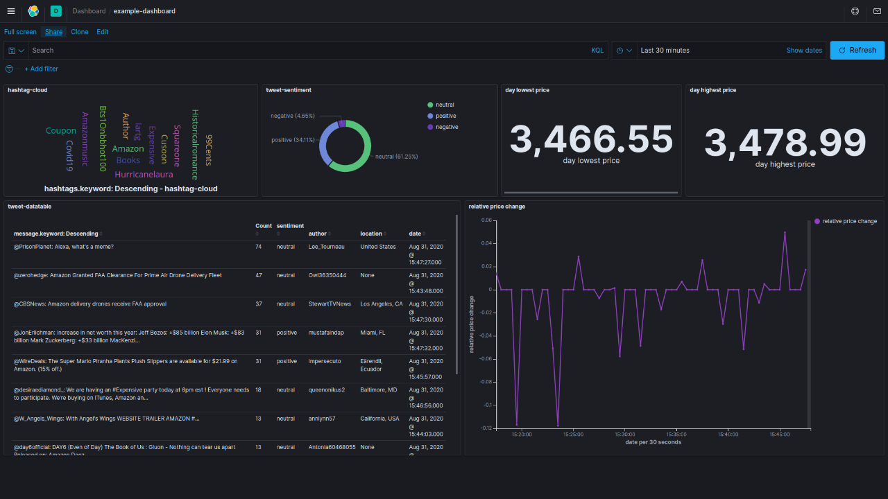

## Stock Insight Engine


Stock insight engine is a stock market analyzer that mines user tweets on Twitter and performs sentiment analysis on them to show how much emotions on Twitter affect the stock prices. It is built upon ,  and . 

## Installation

To be able to use stock insight engine to mine tweets from Twitter, there are a few steps need to be done. Namely, 

1. Apply for a Twitter developer account , then  and generate your 

2. Install Elasticsearch on your local machine. The following has been tested on Ubuntu 20.04

    ```
    curl -fsSL https://artifacts.elastic.co/GPG-KEY-elasticsearch | sudo apt-key add -
    echo "deb https://artifacts.elastic.co/packages/7.x/apt stable main" | sudo tee -a /etc/apt/sources.list.d/elastic-7.x.list
    sudo apt update
    sudo apt install elasticsearch
    ```

    Upon successful installation, start the Elasticsearch service

    ```
    sudo systemctl start elasticsearch
    ```

    To test the installation is successful, do
    ```
    curl -X GET 'http://localhost:9200'
    ```
    which will you give you some snapshot information about the installed Elasticsearch. 

3. Install Kibana. If your Elasticsearch installation is successful, then you just need to do 
    
    ```
    sudo apt install kibana
    ```
    
    and rememeber 
    ```
    sudo systemctl start kibana
    ```
    Once the Kibana service is started, you should be able to access the dashboard via ```localhost:5601```.

4. Install Python dependancies

    It is recommended to use  to manage your env. For example do

    ```
    conda create -n stock python=3.8
    conda activate stock
    pip install -r requirements.txt
    ```

## Usage

1. Put **your** Twitter consumer key and access token in ```config.py```.

2. Edit the ```nltk_tokens_required``` and ```nltk_tokens_ignored``` in ```config.py``` to the Twitter feeds you want to mine. ```nltk_tokens_required``` means 
    the tweets being mined must contain at least one of the tokens in ```nltk_tokens_required``` before being added to Elasticsearch otherwise skipped, and ```nltk_tokens_ignored``` means that if a tweet contains one of the ignored tokens then it will be skipped (not adding to Elasticsearch). The number required tokens can be set in ```nltk_min_required```.

3. To mine tweets talking about ```Amazon``` and ```Jeff Bezos```, do
    ```python get_tweet_sentiment.py -s AMZN -k 'Jeff Bezos',Bezos,Amazon,Alexa,'Blue Origin' --quiet```
    and to further follow URL links in tweets to perform sentiment analysis on that page

    ```python get_tweet_sentiment.py -s AMZN -k 'Jeff Bezos',Bezos,Amazon,Alexa,'Blue Origin' -l --quiet```

4. To get Amazon stock price from , 
    ```python get_stockprice.py -s AMZN --quiet```

## Visualization

Follow  to customize your data visualizations. Here I showcase mine as an illustration.
<p align="center">

</p>

## License

MIT